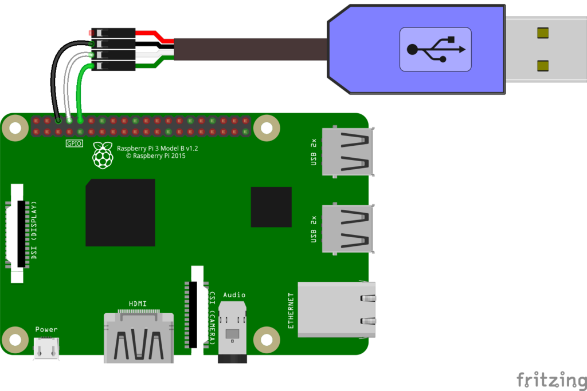

# Connect to the UART serial console


The red cable can power the Raspberry Pi, or it can be disconnected and a standard USB cable be used instead (preferred). **Do not use both!**



Make sure the following entries exist on `/boot/cmdline.txt`
```
console=serial0,115200 console=tty1 
```
Once the cable is attached, run
```
sudo screen /dev/ttyUSB0 115200
```

### More info
https://learn.adafruit.com/adafruits-raspberry-pi-lesson-5-using-a-console-cable
